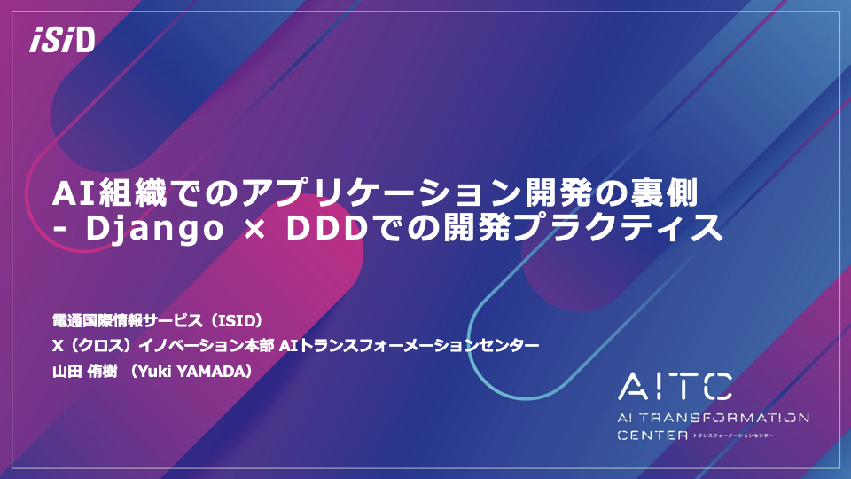

# DLLAB DDD Sample

[エンタープライズAIとモダンアプリケーション開発の実践〜ISID ✕ Microsoft〜 #2](https://dllab.connpass.com/event/259408/)での「AI組織でのアプリケーション開発の裏側 - Django × DDDでの開発プラクティス」セッションで紹介したコードを置いているリポジトリです。

## 発表資料

当日の発表資料はSpeaker Deckで公開しています。

[](https://speakerdeck.com/isidaitc/aizu-zhi-denoapurikesiyonkai-fa-noli-ce-django-x-ddddenokai-fa-purakuteisu)

## プロジェクト構成

プロジェクトルートの`sample_project`配下がDjangoのプロジェクトです。  
`fa_analysis`配下にセッションで紹介したコードを置いています。

`fa_analysis`は一つのDjangoアプリケーションであり、以下のディレクトリ構成になっています。

```sh
fa_analysis
├── __init__.py
├── app_services.py
├── apps.py
├── domains
│   ├── __init__.py
│   ├── analysis.py
│   ├── answer.py
│   └── token.py
├── migrations
│   ├── 0001_initial.py
│   └── __init__.py
├── models
│   ├── __init__.py
│   └── analysis.py
├── repositories
│   ├── __init__.py
│   ├── abstract.py
│   └── analysis.py
├── urls.py
└── views.py
```

テストコードは`sample_project/tests`配下に置いています。

## 動かし方

- Python 3.8
- Poetry

プロジェクトをクローンしてください。

```sh
git clone https://github.com/wf-yamaday/dllab-ddd-sample.git
```

Poetry を使って依存関係をインストールしてください。

```sh
poetry install
```

テストの実行をしてください。

```sh
poetry run pytest sample_project
```

アプリケーションの起動をしてください。

```sh
poetry run sample_project/manage.py runserver
```

http://127.0.0.1:8000/api/ にアクセスし、`Hello, World`の文字が見えることを確認してください。
